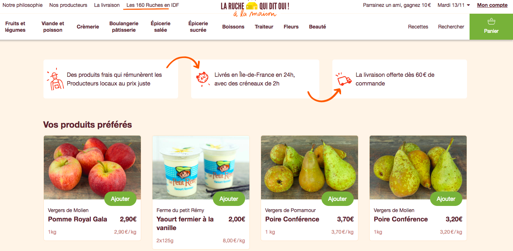

# Le Comptoir Local de Saclay : Un site web pour l'achat en ligne de paniers de produits locavores.


> Cet espace correspond au projet **SaclayComptoirLocal** de la première semaine des coding weeks.

L'**objectif** de ce mini-projet est de développer, de manière très incrémentale, un prototype de ce que pourrait être un site web d'achat en ligne de paniers de produits locaux à l'image de [*La Ruche qui dit oui*](https://laruchequiditoui.fr/fr) ou [*La Ruche qui dit oui à la maison*](https://alamaison.laruchequiditoui.fr/)




Au travers de ce projet, vous decouvrirez les bases de la programmation web en python, avec le framework [Django](https://www.djangoproject.com/) ainsi plusieurs principes du mouvement dit du [*Software Craftmanship*](https://www.octo.com/fr/publications/20-culture-code). 

## Avant de commencer

Faire le tuto Git : https://github.com/hudelotc/CentraleSupelec_CodingWeeks_2020
Faire le test : https://centralesupelec.edunao.com/mod/quiz/view.php?id=36700

## Django et pourquoi Django ?


**Django** est un framework entièrement Python destiné au web au même titre que :

 + [Flask](http://flask.pocoo.org/) dont plusieurs tutoriels sont disponibles [ici](https://realpython.com/tutorials/flask/)
 + [TurboGears](http://www.turbogears.org/)
 + [Web2py](http://www.web2py.com/init/default/index)
 + ...

**Django** est un framework très complet et qui dispose d'une très grande communauté et est donc très [documenté](https://docs.djangoproject.com/en/2.1/). 
Des [exemples de codes](https://djangosnippets.org/) et des [packages réutilisables](https://djangopackages.org/) sont aussi disponibles.
 


Ce projet est inspiré et une adaptation du très bon cours de Céline Martinez Sanchez sur  OpenClassRooms : [Découvrez le framework Django !](https://openclassrooms.com/fr/courses/4425076-decouvrez-le-framework-django).

De même, le [tutorial de Django](https://docs.djangoproject.com/fr/3.1/intro/tutorial01/) lui-même nous servira souvent de support pour la montée en compétences sur cette technologie.

## Organisation du mini-projet

Ce mini-projet est découpé en plusieurs objectifs, eux-même découpés en  **sprints** et **fonctionnalités**. La notion de sprint fait référence à la [méthode agile](https://fr.wikipedia.org/wiki/M%C3%A9thode_agile). Un sprint correspond à un intervalle de temps pendant lequel l’équipe projet va compléter un certain nombre de tâches.

Ce travail de découpage a été fait pour vous mais c'est une des premières étapes à faire pour tout projet de developpement logiciel, au moins de manière macroscopique. **Pensez-y la semaine prochaine !**

### Objectif 1 (MVP): Un site fonctionnel *pas très beau* et *pas très plein* qui affiche un catalogue de produits locaux

Le premier objectif est de constuire et d'implémenter une version simple de notre site que l'on pourrait qualifier de **[MVP (Minimum Viable product)](https://medium.com/creative-wallonia-engine/un-mvp-nest-pas-une-version-simplifi%C3%A9e-de-votre-produit-89017ac748b0)**. Par exemple, dans notre cas, le MVP sera un site qui permet d'afficher en ligne un catalogue de produits locaux, ces derniers étant stockés dans une base de données.

Ce concept de MVP a été popularisé par Eric Ries, l'auteur de [The Lean Startup](http://theleanstartup.com/), une approche spécifique du démarrage d'une activité économique et du lancement d'un produit. La figure ci-dessous permet de bien expliquer ce concept.


 + **Sprint 0** :
	 + [Installation du socle technique.](./Sprint0Installbis.md)
	 + [Analyse des besoins.](./Sprint0Analyse.md) 
	 + [Refexion autour de la conception.](./Sprint0Conception.md)

 + **Sprint 1 : Un premier projet avec [Django](https://www.djangoproject.com/) : un site avec une page d'accueil**  
 
 	+ [**Fonctionnalité 1** : Prise en main de Django : création d'un projet Django.](./S1_djangoproject.md)
 	+ [**Fonctionnalité 2** : Une application pour le catalogue de produits.](./S1_djangoapp.md)
 	+ [**Fonctionnalité 3** : Ajout de la page d'accueil et d'une vue.](./S1_vue.md)

 + **Sprint 2 : Amélioration du site pour afficher une liste de produits et répondre à des requêtes sur ces produits**
 	
 	+ [**Fonctionnalité 4** : Ajouter des produits dans le modèle.](./S1_addmodels.md)
 	+ [**Fonctionnalité 5** : Transmission d'information dans une requête .](./S1_addparameters.md)
 		

 	

### Objectif 2 : Le modèle : ajouter des informations et des données à notre site 

+  **Sprint 3** : **Concever et implémenter le modèle de votre base de données**
	+ [**Fonctionnalité 6** : Un modèle SQL avec SQLDesigner](./S3_model.md) 
	+ [**Fonctionnalité 7** : Création de notre modèle avec l'ORM Django](./S3_ORM.md) 

+  **Sprint 4** : **Migrations vers la base de données** 
	+ [**Fonctionnalité 8** : Mise en place des migrations entre Django et la base de données](./S4_migrations.md)
	+ [**Fonctionnalité 9** : Utilisation de la console Django pour ajouter des données](./S4_ajoutdonnees.md)

+ **Sprint 5** : **Connecter les vues aux données**
	+ [**Fonctionnalité 10** : Mettre à jour les vues pour afficher les données de la base de données](./S5_updateviews.md)


### Objectif 3 : La vue : on améliore le design 
+ **Sprint 6** : **Ameliorer le design de l'application**
	+ [**Fonctionnalité 11** : Choisir un theme pour notre application](./S6_statictheme.md)
	+ [**Fonctionnalité 12** : Integrer les fichiers statiques](./S6_staticthemeintegration.md)


### Objectif 4 : Ajout d'une interface d'administration 

+ **Sprint 7** : **Administrer l'application**

  + [**Fonctionnalité 13** : Administrer notre application](./S7_administrer.md)


### Objectif 5 : On améliore notre site.

A ce stade, nous avons un site minimal avec toutes ses briques fonctionnelles. Vous allez maintenant améliorer votre site de différentes manières. Il faudra vous documenter et chercher l'information pour 

  + En travaillant sur le design et les gabarits : Il vous faudra pour cela vous documenter, par exemple [ici](https://docs.djangoproject.com/fr/2.1/ref/templates/language/) et [ici](https://docs.djangoproject.com/fr/1.11/ref/templates/builtins/). Vous pouvez par exemple déjà associer un gabarit ou une partie de vos gabarits à chacune des vues que vous avez créé précedemment.
 Pour cela, il est souvent nécessaire de faire des maquettes du site en avance et en accord avec votre client.
 Vous avez pour cela un certain nombre d'outils comme par exemple :
  + [Canva](https://www.canva.com/fr_fr/creer/maquette-wireframe-site-web/)
  + [MockFlow](https://www.mockflow.com/)
  + [InVision](https://www.invisionapp.com/)
 
 
  + En passant des paramètres et donc vos données à vos gabarits via les vues, le fichier `views.py` et la méthode `render`qui prend en premier paramètre un dictionnaire de variables à utiliser dans le gabarit. 
  
 Par exemple, pour la page d'accueil et la vue lui correspondant, on peut mettre à jour la méthode `index`de la manière suivante :

```python
def index(request):
    products = Product.objects.filter(available=True).order_by('-created_at')[:12]
    ...
    context = {
        'products': products
    }
    return HttpResponse(template.render(context, request=request))
```

et en l'affichant dans le gabarit (dans le fichier `.html`) via la syntaxe :

```html
<ul>

    <li>{{ products }}</li>

</ul>
```

 + En générant automatiquement les url dans votre fichier de gabarit. Par exemple, supposons que vous ayez généré l'URL pattern suivant dans votre fichier `urls.py`, pour permettrr d'avoir une page pour produit (on veut par exemple afficher le détail de chaque produit). Vous auriez dans votre fichier `urls.py`:

```python
 ...
urlpatterns = [
    url(r'^(?P<product_id>[0-9]+)/$', views.detail, name='detail'),
]
```
Il vous faut maintenant ajouter dans le fichier html correspondant le code suivant :

```html
<a href="">
  
</a>
```
Cela suppose bien entendu que vous avez ajouté un champ `image` à votre modèle de produits.


 + En ajoutant un [formulaire de recherche](https://openclassrooms.com/fr/courses/1603881-apprenez-a-creer-votre-site-web-avec-html5-et-css3/1607171-les-formulaires) à votre site web. 

 Il faudra pour cela que vous ajoutiez un gabarit `search_form.html`, dans lequel vous écrirez un formulaire de recherche.
 
 ```html
 <div class="col-lg-12 detail-separator">
  <form class="col-md-6 col-md-offset-3 text-center" action="" method="get" accept-charset="utf-8">
    <div class="form-group">
      <label for="searchForm">Chercher un produit</label>
      <input id="searchForm" class="form-control">
    </div>
    <span class="help-block" id="helpBlock">Donner son nom et son producteur.</span>
  </form>
</div>
 ```
 
 que vous pourrez par exemple inclure dans votre fichier `index.html` via la commande :
 
 ` <!-- NEW -->`
 
La [documentation](https://docs.djangoproject.com/en/2.1/) de Django est très bien faite donc n'hésitez pas à la parcourir.

Faites un maximum, pensez à bien tester votre code et à déposer sur votre dépôt le code de votre site.


  
 


