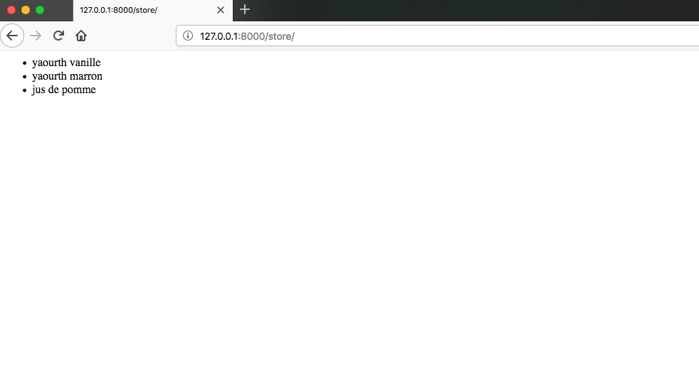
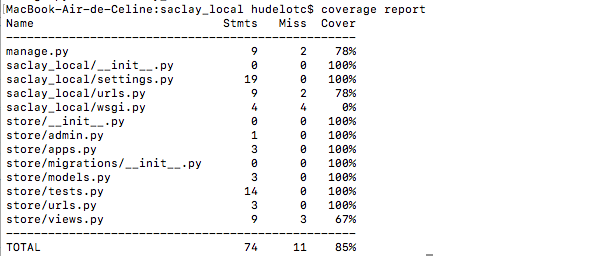

# Fonctionnalité 4 : Ajouter des produits dans le modèle - Une nouvelle vue


Nous allons maintenant ajouter une nouvelle vue qui liste des produits en vente sur notre application.

## Etape 1 : Ajout de données dans `models.py`

On n'utilisera pas de base de données dans cette étape et on se contentera d'ajouter 3 produits d'un même producteur dans le fichier `models.py`

```PYTHON
PRODUCERS = {
  'ferme_viltain': {'name': 'Ferme_de_Viltain'},
}


PRODUCTS = [
  {'name': 'yaourth_vanille', 'producers': [PRODUCERS['ferme_viltain']]},
  {'name': 'yaourth_marron', 'producers': [PRODUCERS['ferme_viltain']]},
  {'name': 'jus_de_pomme', 'producers': [PRODUCERS['ferme_viltain']]}
]
```


## Etape 2 : Ajout d'une vue

Appliquer la même prodécure que dans la fonctionnalité précédente pour :

+ ajout d'une url dans `store/urls.py`
+ ajout d'une vue dans `views.py`
+ récupération des données du modèle

**Cette partie nécessite de la réflexion et du travail en autonomie. N'hésitez pas à chercher sur google et à [regarder la doc de django](https://docs.djangoproject.com/en/2.1/intro/)**.

On essaiera ici à nouveau de mettre en oeuvre la technique TDD. 

Vous devez avoir ceci.




## Etape 3 : couverture de code par vos tests

Une couverture de code par les tests (code coverage) nous permet de connaître le pourcentage de notre code qui est testé et donc cela permet d'avoir une idée de ce qui reste d'ombre dans notre projet.

En règle générale, on considère qu'une couverture de code supérieure à 80% est signe d'un projet bien testé et auquel il sera alors plus facile de rajouter de nouvelles fonctionnalités.

Pour connaitre le taux de couverture de notre projet, nous pouvons utiliser des bibliothèques python, en particulier [`coverage`](https://coverage.readthedocs.io/en/v4.5.x/install.html), qu'il faut donc installer soit en ligne de commande soit depuis votre IDE.

`pip3 install coverage`

Pour tester le taux de couverture de votre projet Django, il suffit donc de taper la commande :

`coverage run --source='.' manage.py test`

Puis la commande `coverage report` vous permet d'afficher un bilan et un état de la couverture de votre code.




## A propos de la gestion des versions

<span style='color:blue'> Pour toute la suite du projet, il vous est demandé de :</span> 

+ <span style='color:blue'>Faire un commit dès que la réalisation d'une fonctionnalité ou d'une sous-fonctionnalité est finie.</span> 
+ <span style='color:blue'>Tagger à la fin de chaque journée votre dernier commit </span> 
+ <span style='color:blue'>Pousser (Push) votre code vers votre dépôt distant sur GitLab.</span> 
+ <span style='color:blue'>Faire un test de couverture de code à la fin de chaque journée et de pousser le bilan obtenu vers votre dépôt distant sur GitLab.</span>


vous pouvez maintenant passer à la [**Fonctionnalité 5** : Transmission d'information dans une requête .](./S1_addparameters.md)


