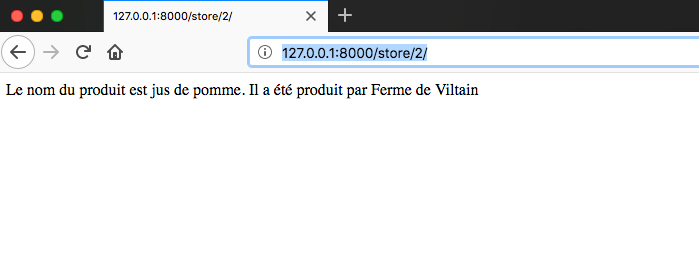

# Fonctionnalité 5 : Transmission d'information dans une requête 

L'objectif de cette fonctionnalité est d'jouter deux nouvelles vues à notre projet :

 + Une vue pour afficher les informations sur le producteur d'un produit.
 + Une vue pour afficher les résultats d'un formulaire de recherche comme par exemple la recherche de produit.

## Etape 1 : Ajouter une vue pour afficher les informations sur le producteur d'un produit
 
En vous inspirant du [tutoriel](https://docs.djangoproject.com/fr/1.11/intro/tutorial03/#writing-more-views) de Django ou de celui d'[OpenClassRooms](https://openclassrooms.com/fr/courses/4425076-decouvrez-le-framework-django/4631210-passez-des-arguments-a-une-vue), ajouter à votre application une vue, en mode TDD, pour permettre d'afficher des informations sur un produit donné.

Typiquement, pour l'url `http://127.0.0.1:8000/store/2/, vous devez avoir le site ci-dessous.

+ Ajouter votre fichier à votre dépôt git.
+ Faire un commit
+ Pousser (Push) votre code vers votre dépôt distant sur GitLab. 

 
## Etape 2 : Afficher les résultats d'un formulaire

Nous voulons maintenant afficher les résultats d'une requête comme par exemple `http://127.0.0.1:8000/store/search/?query=Ferme_de_Viltain`

Ecrire la vue permettant de répondre à ce type de requête. On appliquera ici aussi l'approche TDD ou on ajoutera les tests à l'application permettant de maintenir une bonne couverture de notre code.

Nous arrivons à la fin de notre MVP. 

## Pour finir 

+ Faire un commit de vos derniers changements. 
+ Tagger ce dernier commit  
+ Pousser (Push) votre code vers votre dépôt distant sur GitLab. 
+ Faire un test de couverture de code de votre MVP et pousser le bilan obtenu vers votre dépôt distant sur GitLab.

Et on peut maintenant passer à l'[objectif 2](./TemplateProject_SacalyLocal.md).

   