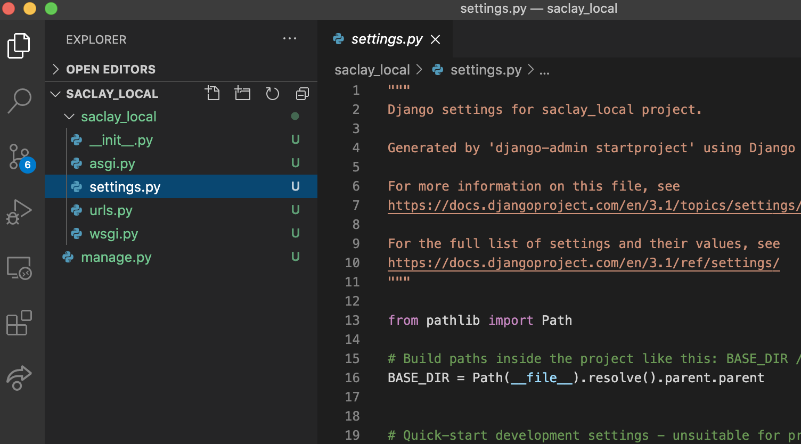

# Fonctionnalité 1 : Prise en main de Django - Création d'un projet Django


L'objectif de cette fonctionnalité est d'installer le framework Django et de créer un premier projet *Django* à l'aide du framework et initiant ainsi votre application **saclay local**.

## Etape 1 : Installation de Django

La première étape consiste en l'installation de Django. On peut le faire facilement via l'utilitaire Pypi avec la commande 
`pip install django` ou tout simplement à partir de PyCharmEdu en installant et en associant le package Django à votre projet à partir du menu `Preferences`de PyCharm.

Dans sa version professionnelle, PyCharm possède des [outils adaptés](https://www.jetbrains.com/help/pycharm/creating-django-project.html) aux projets Django mais qui ne sont pas disponibles dans PyCharmEdu.


Vous pouvez tester l'installation de Django en testant la commande `import django` dans votre console python et en demandant quelle est la version avec la commande `django.get_version()`


## Etape 2 : Creer la structure de votre projet Django

A l'aide de votre terminal, placer vous à la racine du répertoire de votre projet `saclaylocal` et tapez la commande suivante :

`django-admin startproject saclay_local`

Cette commande a permis de créer la structure de votre projet Django et vous devriez avoir maintenant cette structure dans votre projet PyCharmEdu





Vous devrier donc avoir un répertoire `saclay_local` contenant un fichier `manage.py`et un package python `saclay_local` avec les modules `settings.py`, `urls.py`et `wsgi.py` (et un fichier `__init__.py`)


 + Le premier répertoire racine `saclay_local` n’est qu’un contenant pour votre projet. 
+ `manage.py` est un utilitaire en ligne de commande qui vous permet d’interagir avec ce projet Django de différentes façons. Vous trouverez toutes les informations nécessaires sur `manage.py` [ici](https://docs.djangoproject.com/fr/2.1/ref/django-admin/) 
+ Le sous-répertoire `saclay_local` correspond au package Python effectif de votre projet. 
+ `__init__.py` est un fichier vide qui indique à Python que le répertoire précédent doit être considéré comme un package.
+ `settings.py` est un fichier pour les réglages et configuration de ce projet Django. Une documentation est disponible [ici](https://docs.djangoproject.com/fr/2.1/topics/settings/).
+ `urls.py` est le fichier dans lequel sera fait les déclarations des URL de ce projet Django, c'est une sorte de *table des matières*  de votre site Django.
+ `wsgi.py` : un point d’entrée pour les serveurs Web compatibles WSGI pour déployer votre projet. La documentation est disponible [ici](https://docs.djangoproject.com/fr/2.1/howto/deployment/wsgi/)


Nous reviendrons sur ces différents fichiers dans la suite de ce projet.


## Etape 3 : Installer PostgreSQL comme gestionnaire de bases de données.

Nous allons ici utiliser le framework [PostgreSQL](https://www.postgresql.org/) comme gestionnaire de bases de données. 

Nous allons en particulier nous baser sur la bibliothèque [psycopg](http://initd.org/psycopg/docs/) qui permet d'utiliser l'utilitaire PostgreSQL en python. Il faut donc l'installer et l'associer à votre projet soit en utilisant la commande `pip install psycopg2`soit directement depuis PyCharmEdu (ce qui est préférable pour l'associer correctement avec votre projet).


Il faut maintenant installer PostgreSQL sur votre ordinateur et pour cela vous allez vous référer à la documentation officielle et suivre les instructions adpatées à votre système d'exploitation [ici](https://www.postgresql.org/download/).

Vous pourrez vérifier l'installation en tapant la commande `psql` dans un terminal. Cette commande devrait vous ouvrir une console PostgreSQL dans laquelle vous pouvez interagir avec les différentes bases du système.


Pour quitter cette console il faut utiliser `\q`

## Etape 4 : Lancer le serveur

PostgreSQL est un système de gestion de bases de données fonctionnant en mode [**client-serveur**](https://en.wikipedia.org/wiki/Client%E2%80%93server_model). Il faut donc demarrer les serveurs pour pouvoir intéragir avec vos bases de données.
La commande suivante devrait vous permettre de le faire :

`postgres -D /usr/local/pgsql/data`

Prenez le temps de lire [cette documentation](https://www.postgresql.org/docs/current/server-start.html) si vous avez des problèmes suite à l'execution de cette commande ce qui est fort possible. Chercher par vous même avant de demander de l'aide.

## Etape 5 : Créer une base de données pour notre application

Nous allons maintenant créer une base de données pour notre application `saclaylocal`

Pour cela, il faut utiliser la commande suivante :

`createdb -O hudelotc saclaylocal `

avec bien sûr votre nom d'utilisateur.

Vous pourrez ensuite vérifier que la base a bien été créée à l'aide de la commande `\l` dans la console `psql`. 


## Etape 5 : Associer votre base de données à votre projet Django `saclay_local`

Revenons maintenant à notre projet Django. Il faut maintenant associer la base de données que nous venons de créer à notre projet. Pour cela il faut modifier le contenu du fichier `settings.py` qui contient actuellement le code suivant :

```PYTHON
"""
Django settings for saclay_local project.

Generated by 'django-admin startproject' using Django 2.1.2.

For more information on this file, see
https://docs.djangoproject.com/en/2.1/topics/settings/

For the full list of settings and their values, see
https://docs.djangoproject.com/en/2.1/ref/settings/
"""

import os

# Build paths inside the project like this: os.path.join(BASE_DIR, ...)
BASE_DIR = os.path.dirname(os.path.dirname(os.path.abspath(__file__)))


# Quick-start development settings - unsuitable for production
# See https://docs.djangoproject.com/en/2.1/howto/deployment/checklist/

# SECURITY WARNING: keep the secret key used in production secret!
SECRET_KEY = 'kci6q6bp8p3igyn&=ux!z787la841haypkj&=7#(u)d9j9vuyo'

# SECURITY WARNING: don't run with debug turned on in production!
DEBUG = True

ALLOWED_HOSTS = []


# Application definition

INSTALLED_APPS = [
    'django.contrib.admin',
    'django.contrib.auth',
    'django.contrib.contenttypes',
    'django.contrib.sessions',
    'django.contrib.messages',
    'django.contrib.staticfiles',
]

MIDDLEWARE = [
    'django.middleware.security.SecurityMiddleware',
    'django.contrib.sessions.middleware.SessionMiddleware',
    'django.middleware.common.CommonMiddleware',
    'django.middleware.csrf.CsrfViewMiddleware',
    'django.contrib.auth.middleware.AuthenticationMiddleware',
    'django.contrib.messages.middleware.MessageMiddleware',
    'django.middleware.clickjacking.XFrameOptionsMiddleware',
]

ROOT_URLCONF = 'saclay_local.urls'

TEMPLATES = [
    {
        'BACKEND': 'django.template.backends.django.DjangoTemplates',
        'DIRS': [],
        'APP_DIRS': True,
        'OPTIONS': {
            'context_processors': [
                'django.template.context_processors.debug',
                'django.template.context_processors.request',
                'django.contrib.auth.context_processors.auth',
                'django.contrib.messages.context_processors.messages',
            ],
        },
    },
]

WSGI_APPLICATION = 'saclay_local.wsgi.application'


# Database
# https://docs.djangoproject.com/en/2.1/ref/settings/#databases

DATABASES = {
    'default': {
        'ENGINE': 'django.db.backends.sqlite3',
        'NAME': os.path.join(BASE_DIR, 'db.sqlite3'),
    }
}


# Password validation
# https://docs.djangoproject.com/en/2.1/ref/settings/#auth-password-validators

AUTH_PASSWORD_VALIDATORS = [
    {
        'NAME': 'django.contrib.auth.password_validation.UserAttributeSimilarityValidator',
    },
    {
        'NAME': 'django.contrib.auth.password_validation.MinimumLengthValidator',
    },
    {
        'NAME': 'django.contrib.auth.password_validation.CommonPasswordValidator',
    },
    {
        'NAME': 'django.contrib.auth.password_validation.NumericPasswordValidator',
    },
]


# Internationalization
# https://docs.djangoproject.com/en/2.1/topics/i18n/

LANGUAGE_CODE = 'en-us'

TIME_ZONE = 'UTC'

USE_I18N = True

USE_L10N = True

USE_TZ = True


# Static files (CSS, JavaScript, Images)
# https://docs.djangoproject.com/en/2.1/howto/static-files/

STATIC_URL = '/static/'


```

Prenez le temps de lire ce programme et essayez de comprendre sa logique. A quel endroit du scrit allez-vous modifier quelque chose ?

Il faut modifier la constante `DATABASES`. En effet :

 + Notre moteur gestionnaire de base de données n'est pas `sqlite3` mais `posrgresql`. Il faut donc modifier la valeur associée à la clé `'ENGINE'`par ` 'django.db.backends.postgresql'`. 
 + Vous pouvez spécifier votre nom d'utilisateur avec la clé `'USER'` et mettre à jour le nom de votre base de données avec la clé `'NAME'`. Ici la valeur doit être `'saclaylocal ' `.

 
## Etape 6 : Lancer le serveur Django

Vous pouvez maintenant lancer le serveur de développement Django avec la commande 

`./manage.py runserver `

Un problème ? Lisez le message et **faites ce qui vous est conseillé**.

Avec cette commance, vous avez démarré le serveur de développement de Django, un serveur Web léger entièrement écrit en Python qui est inclus avec Django de façon à vous permettre de développer rapidement, sans avoir à vous occuper de la configuration d’un serveur de production tant que vous n’en avez pas besoin.


L'exécution du script `./manage.py runserver`  affiche un ensemble d'information et en particulier vous donne l'addresse url du serveur de développement.

`Starting development server at http://127.0.0.1:8000/`

Vous pouvez maintenant ouvrir cette url (très souvent `http://127.0.0.1:8000/`) avec votre navigateur et vous devriez avoir cette page.


Nous avons fini cette fonctionnalité donc n'oubliez pas de : 

+ <span style='color:blue'>Faire un commit sur votre dépôt local.</span> 
+ <span style='color:blue'>Pousser (Push) votre code vers votre dépôt distant sur GitLab.</span> 


Nous pouvons maintenant passer à la [**Fonctionnalité 2** : Une application pour le catalogue de produits.](./S1_djangoapp.md)

