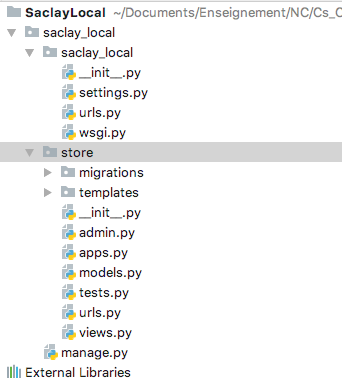
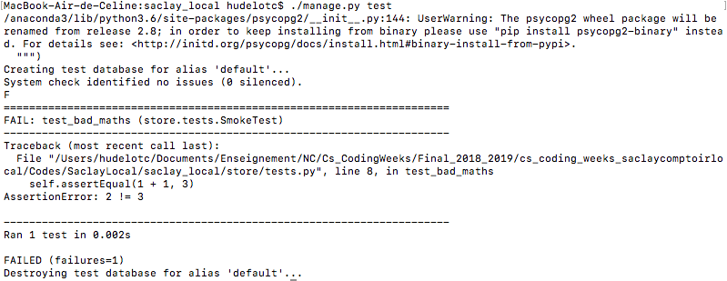

# Fonctionnalité 3 : Ajout de la page d'accueil et d'une vue à notre application `store`


## Etape 1 : Structuration de l'application `store` en suivant le MVT.


Revenons à notre application `store` et regardons la structuration qui a été générée par Django. On retrouve bien une partie du modèle **MVT** avec:

+ le fichier `models.py` qui regroupera les modèles,
+ le fichier `views.py` qui regroupera les vues.

Il n'y a par contre pas de référence aux templates. Il nous faut donc maintenant créer un repertoire `templates` dans notre application vue qui contiendra les différents gabarits de notre application.

Ajouter ce répertoire à votre projet. On ajoutera ensuite à ce répertoire un sous-repertoire du nom de notre application.

Votre projet devrait maintenant avoir cette structuration




## Etape 2 : Mise à jour des urls.

Les URLs représentent les routes de navigation de notre site. Pour les définir, nous allons ajouter un fichier `urls.py` à notre applicaton `store`.

```py
urlpatterns = []
```

Ensuite mettez à jour le fichier `urls.py` du projet `saclay_local`en important le contenu du fichier `urls.py` de `store`de la manière suivante :

```py
from django.contrib import admin

...

urlpatterns = [
    path('admin/', admin.site.urls),
    path('store/', include('store.urls')),
]
```


## Etape 3 : Créer une vue en mode TDD.

L'objectif de cette étape est d'afficher le message suivant *"Bienvenue sur le comptoir local de Paris Saclay!"* lorque  l'utilisteur entrera l'URL `http://127.0.0.1:8000/store/ `
 
 Nous allons profiter de cette étape pour parler des tests et en particulier, nous allons utiliser une approche de développement guidée par les tests, l'approche **TDD**.
 Le **TDD (Test Driven Development)** est un développement dirigé par les tests et donc la première ligne de votre programme doit être dans un fichier de tests. Dans notre cas, nous utiliserons le module [`unittest`](https://docs.python.org/3/library/unittest.html) car vous trouverez plus facilement de la documentation sur unittest et Django que pour `pytest`. Il est cependant possible d'utiliser `pytest` et une module spécifique `pytest-django` pour utiliser `pytest`pour tester des applications django.
 
Un ouvrage est dédié à l'approche TDD pour les applications Django. Vous pouvez le trouver [ici](https://www.obeythetestinggoat.com/book/chapter_unit_test_first_view.html). 

 
Le principe du TDD repose sur 3 étapes complémentaires.
 
   + Première étape (**<span style='color:red'>RED</span>**) : Ecrire un premier test qui échoue.
   + Deuxième étape (**<span style='color:green'>GREEN</span>**) : Ecrire le code le plus simple qui permet de passer le code.
   + Troisième étape (**REFACTOR**) : Améliorer le code source.


Nous allons donc appliquer cette méthode à cette étape de création de la vue pour la page d'accueil de notre site.


#### **<span style='color:red'> ETAPE RED</span>**

Notre premier test va consister à tester que quand un utilisateur arrive sur notre page d'accueil (qui est pour l'instant à `http://127.0.0.1:8000/store/ `) , alors il a bien le message d'accueil *"Bienvenue sur le comptoir local de Paris Saclay!"*

Nous allons donc nous placer dans le fichier `tests.py` de notre application `store`.

Avant d'écrire les tests correspondants à cette fonctionnalité, nous allons  reprendre l'exemple donné [ici](https://www.obeythetestinggoat.com/book/chapter_unit_test_first_view.html) pour comprendre comment se passe les tests avec Django et Unittest.

Dans le fichier `tests.py`, recopier le code ci-dessous :

```PYTHON
class SmokeTest(TestCase):

    def test_bad_maths(self):
        self.assertEqual(1 + 1, 3)

```

Puis lancer la commande ` python manage.py test`. 

Vous devriez avoir l'exécution de vos tests qui échouent comme ci-dessous





Revenons à notre fonctionnalité : quand un utilisateur arrive sur notre page d'accueil, alors il a bien le message d'accueil *"Bienvenue sur le comptoir local de Paris Saclay!"*.

Ceci se traduit pour Django par les actions suivantes :

 + Reception d'une requête HTTP pour une url spécifique (on utilisera donc ici [HTTPRequest](https://docs.djangoproject.com/en/2.1/ref/request-response/#django.http.HttpRequest).
 + Django décide de quelle fonction de vue il doit utiliser pour la requête (URL resolving)
 + La fonction de vue traite la requête et renvoie une reponse HTTP ([HTTPResponse](https://docs.djangoproject.com/fr/1.11/ref/request-response/#httpresponse-objects). Nous utilisons [`HttpResponse`](https://docs.djangoproject.com/fr/1.11/ref/request-response/#httpresponse-objects) car une vue doit retourner une réponse valide pouvant être interprétée par un navigateur.


 Dans notre cas, nous voulons donc tester deux choses :

+ Vérification de l'URL de la racine du site pour une fonction `index` de `views` (URL resolve)
+ Vérification que la fonction `index` renvoie  bien la bonne réponse.

Ecrivons donc les tests correspondants à ces deux vérifications.

```PYTHON
from django.urls import resolve
from django.test import TestCase
from store.views import index
from django.http import HttpResponse, HttpRequest

# Create your tests here.


class WelcomePageTest(TestCase):

    def test_root_url_resolves_to_welcome_page_view(self):
        found = resolve('/')
        self.assertEqual(found.func, index)

    def test_welcome_page_returns_correct_html(self):
        request = HttpRequest()
        response = index(request)
        html = response.content.decode('utf8')
        message = "Bienvenue sur le comptoir local de Paris Saclay!"
        self.assertTrue(html==message)

```


Nous lançons ensuite ces tests avec la commande ` python manage.py test` qui <span style='color:red'>échouent</span>. 


#### **<span style='color:green'> ETAPE GREEN</span>**

Nous allons maintenant écrire le code qui permet de faire passer ce test le plus rapidement possible.

Il suffit pour cela de :

 + Il faut repondre à l'erreur nous disant que le module `store.views`n'a pas de fontion `index`.
 Rajoutons donc le code suivant dans le module `views`
 
 ```PYTHON
def index():
    pass
 ```
 
 + On relance les tests. Il faut maintenant répondre à l'erreur générée par `resolve('/')`. En particulier, nous voulons que notre page d'accueil se trouve à la racine de notre site.

 
Ajoutons donc dans le fichier `urls.py` du projet `saclay_local`, le code suivant :

```PYTHON
...
from django.urls import re_path
import store.views

urlpatterns = [
	...
    re_path(r'^$', store.views.index, name='index'),
]


```


 
Le premier test devrait cette fois-ci passer.

Attaquons nous donc maintenant au second test qui est toujours en echec. Nous pouvons répondre au problème `index() takes 0 positional arguments but 1 was given` en modifiant la fonction `index` de la manière suivante:

```PYTHON
from django.http import HttpResponse

def index(request):
    message = "Bienvenue sur le comptoir local de Paris Saclay!"
    return HttpResponse(message)

```
 
Vos tests devraientt passer au vert avec cette étape **<span style='color:green'> ETAPE GREEN</span>**
 

#### **<span style='color:black'> ETAPE REFACTOR</span>**
   
La dernière étape consiste en une étape de [refactoring](https://refactoring.com/), à mettre en place si nécessaire.   

Le [refactoring](https://en.wikipedia.org/wiki/Code_refactoring)(ou réusinage de code) est un principe de programmation qui consiste à changer la structure interne d’un logiciel sans en changer son comportement observable. C'est une étape qui doit toujours être exécutée quand les différents tests sont au vert et qui n'est pas obligatoire. Elle doit surtout permettre d'améliorer la **qualité du code** par exemple en améliorant :
 
 + **la conception** : decoupage en fonctions, modules ou classes afin de rendre votre code le plus simple possible.
 + **la lisibilité du code** : il faut ici prendre le temps d'appliquer les principes du [clean code](https://cleancoders.com/cart) introduit par Robert C. Martin dans l'ouvrage du même nom et dont un des principe est celui des boy-scouts (*« The Boy Scout Rule »*): *« Toujours laisser un endroit dans un état meilleur que celui où vous l’avez trouvé »*.
 
Dans notre cas, une des premiers principes est de vérifier du bon nommage (variables, fonctions, packages, classes et cie) et de la présence de commentaires dans notre code. 
 
 Vous trouverez [ici](https://github.com/zedr/clean-code-python#objects-and-data-structures) quelques principes du clean code transposé au langage python. Prenez le temps de lire rapidement ce site et appliquer ces différents principes au code que vous allez écrire.
 
Dans cette étape **<span style='color:black'> ETAPE REFACTOR</span>**, on peut aussi travailler à l'optimisation des performances du programme si cela s'avère vraiment nécessaire.
 
 
Dans notre cas, cette étape n'est pas forcement nécéssaire. On peut, pour appliquer le refactoring, par exemple procéder à une étape de renommage sur la variable `message`. En effet, il peut par exemple être plus explicite de nommer cette variable `welcome_message`. Pour réaliser cette étape de renommage, il est fortement conseillé d'utiliser les fonctionnalités de Refactoring de votre IDE. En effet, ici cela ne vous semble peut être pas très utile mais avec un code plus complexe, ce sera très utile. Avec PyCharm Edu, il vous suffit de selectionner la variable à renommer et à acceder au menu **Refactor** par un clic droit (ou par MAJ F6) et d'acceder à la fonctionnalité **Rename** pour saisir le nouveau nom `index` seront alors simultanément renommer en `welcome_message`.


#### **ATTENTION**

1. **Après cette étape, n'oubliez pas de relancer les tests pour vérifier que le comportement de votre code n'a pas changé et que tout est encore bien AU VERT !**

2. On vient ici de terminer la réalisation de l'étape *Créer une vue* et il convient donc de **committer ce changement dans votre gestionnaire de version avec un message de commit explicite reprenant l'objectif de l'étape**. Pensez aussi à mettre à jour votre dépôt distant.

#### <span style="color: #26B260">A ce stade du projet, vous avez atteint le JALON 3 : Ecrire du code dans une démarche TDD </span> 


Nous pouvons maintenant passer à le [**Fonctionnalité 4** : Ajouter des produits dans le modèle.](./S1_addmodels.md)

 


